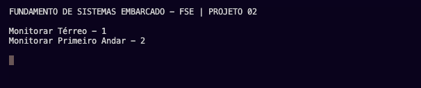
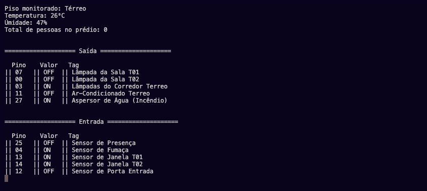

# FSE-2021_2_projeto_2
Trabalho 02 da disciplina de Fundamentos de Sistemas Embarcados (2021/2)

## Objetivo 
Este trabalho tem por objetivo a criação de um sistema distribuído de automação predial para monitoramento e acionamento de sensores e dispositivos de um prédio de 2 andares. O sistema deve ser desenvolvido para funcionar em um conjunto de placas Raspberry Pi com um servidor central responsável pelo controle e interface com o usuário e servidores distribuídos para leitura e acionamento dos dispositivos. Dentre os dispositivos envolvidos estão o monitoramento de temperatura e umidade, sensores de presença, sensores de fumaça, sensores de contagem de pessoas, sensores de abertura e fechamento de portas e janelas, acionamento de lâmpadas, aparelhos de ar-condicionado, alarme e aspersores de água em caso de incêndio.

## Links importantes
Para acessar o repositório template para o trabalho apresentado, clique [aqui](https://gitlab.com/fse_fga/trabalhos-2021_2/trabalho-2-2021-2). 

## Observações

## Funcionamento
### Controle
* Monitoramento Térreo 
    - Dígito 01
* Monitoramento Primeiro andar 
    - Dígito 02

## Prints 
### Menu Inicial 

### Saídas 

## Como executar?
> Clone este repositório:

    git clone https://github.com/victordsantoss/FSE-2021_2_projeto_02
> Acesse a pasta raiz do repositório:

    cd FSE-2021_2_projeto_02
> Na raiz de cada pasta (servidor_central e servidor_distribuido) crie uma pasta chamada bin:

    mkdir bin
> Execute na pasta raiz do repositório:
    
    make
> Rode o processo de execução

    ./bin/bin
